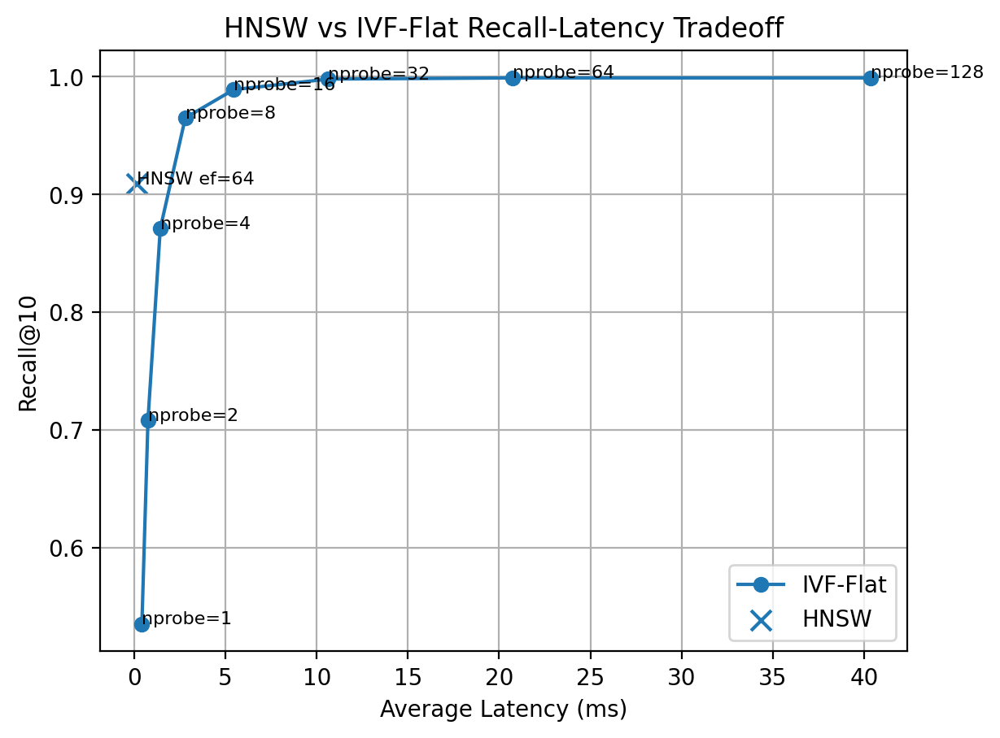

# HyperSearch

A high-performance approximate nearest neighbor (ANN) vector search engine written from scratch in modern C++.

### Key Results (SIFT1M)

- HNSW: **0.909 Recall@10**, **0.135 ms/query**, **234.24x faster than brute-force**
- IVF-Flat: **0.989 Recall@10**, **5.45 ms/query**, **5.8x faster than brute-force**
- IVF-PQ: **12.7x memory reduction**, **1.76 ms/query**, **0.693 Recall@10**
- PQ: **15.9x memory reduction** while remaining **2.5x faster than brute-force**
- Multithreaded IVF-PQ: **2029 QPS** on a 10-core CPU

Built from scratch using:
IVF • PQ • SQ8 • HNSW • AVX2 SIMD • Serialization • Multithreading

This project implements exact and approximate vector search methods used in retrieval systems, recommendation systems, semantic search, and vector databases. The goal is to study and build the core infrastructure behind FAISS-style vector search engines, with emphasis on algorithmic depth, memory efficiency, multithreading, and benchmarking discipline.

## Why Build This?

Most developers use vector databases such as FAISS, Pinecone, Weaviate, or Chroma.

HyperSearch was built to understand and implement the underlying ANN algorithms from first principles, including clustering-based search (IVF), quantization-based compression (SQ/PQ), graph-based search (HNSW), SIMD acceleration, serialization, and large-scale benchmarking on SIFT1M.

## Systems Concepts Demonstrated

- Approximate nearest neighbor search
- k-means clustering
- Product Quantization (PQ)
- Scalar Quantization (SQ8)
- Graph-based ANN search (HNSW)
- AVX2 SIMD vectorization
- Binary serialization
- Memory-performance tradeoff analysis
- Recall@k evaluation
- Latency benchmarking (P50/P95)
- Multithreaded throughput scaling
- Large-scale benchmarking on SIFT1M

## Highlights

- Built a vector search engine from scratch in modern C++
- Implemented IVF, SQ8, PQ, IVF-SQ, IVF-PQ, and HNSW from scratch
- Added AVX2 SIMD-optimized L2 distance kernels
- Benchmarked on the full **SIFT1M** dataset (1 million vectors)
- Achieved **73x latency speedup** at low-recall IVF settings
- Achieved **0.989 Recall@10 at 5.6x speedup**
- Achieved **12.7x memory reduction** with IVF-PQ while maintaining sub-2 ms query latency
- Reached **2064 queries/sec** with multithreaded IVF-PQ
- Implemented HNSW graph-based ANN search achieving **0.909 Recall@10 at 0.135 ms/query on SIFT1M**, delivering a **234.24x** latency improvement over exact brute-force search.
- Added binary index serialization and persistence
- Save trained indexes and reload without retraining

## Current Features

- Exact brute-force k-nearest-neighbor search
- Squared L2 distance kernel
- Heap-based top-k selection
- Abstract `Index` interface
- AVX2 SIMD-optimized distance kernels
- IVF-Flat index with k-means clustering
- Scalar Quantization (SQ8)
- IVF-SQ8 index
- Product Quantization (PQ)
- IVF-PQ index with asymmetric distance computation (ADC)
- Recall@k evaluation
- P50 / P95 latency benchmarking
- Memory usage reporting
- Multithreaded batch throughput benchmark
- CSV benchmark export
- SIFT1M `.fvecs` / `.ivecs` dataset loader
- HNSW graph-based ANN index with hierarchical search, `M`, `efSearch`, and `efConstruction`
- HNSW index serialization
### Persistence
- BruteForce index serialization
- IVF-Flat index serialization
- IVF-SQ index serialization
- IVF-PQ index serialization
- HNSW index serialization
- Binary save/load support for quantizer state and ANN structures

#### Example
```
ann::IVFPQIndex index(...);

index.build(data.data(), num_vectors, dim);
index.save("sift_ivfpq.index");

ann::IVFPQIndex loaded(...);
loaded.load("sift_ivfpq.index");

auto results = loaded.search(query.data(), 10);
```

## Benchmark Setup

Final benchmark configuration:

- Dataset: SIFT1M
- Base vectors: 1,000,000
- Query vectors: 100
- Dimension: 128
- Metric: Squared L2 distance
- SIMD Acceleration: AVX2
- k: 10
- Build type: Release
- Compiler: GCC 14.2.0 (MSYS2 UCRT64)
- Platform: Windows
- CPU: 10-core laptop CPU

## Benchmark Plots

### Recall-Latency Scatter Plot


This plot shows the ANN tradeoff between Recall@k (here k=10) and latency.

### IVF-Flat Recall-Latency Tradeoff


This plot shows the core ANN tradeoff: increasing `nprobe` improves Recall@10 but increases query latency.

### HNSW vs IVF-Flat Recall-Latency Tradeoff



This plot compares graph-based HNSW search against IVF-Flat, showing HNSW’s low-latency operating point and IVF’s recall-latency sweep.

### Memory Usage


Quantized indexes significantly reduce memory usage. PQ-based indexes provide the largest compression.

### Parallel Throughput Scaling


IVF-PQ parallel batch search scales with thread count on the full SIFT1M benchmark.

## Benchmark Results

### Brute Force Baseline

| Index | Recall@10 | Avg Latency | P50 | P95 | Memory |
|---|---:|---:|---:|---:|---:|
| BruteForce | 1.000 | 31.69 ms | 30.99 ms | 36.59 ms | 512 MB |

### HNSW Graph Index

| Index | M | efSearch | efConstruction | Recall@10 | Avg Latency | P50 | P95 | Memory | Speedup vs Brute |
|---|---:|---:|---:|---:|---:|---:|---:|---:|---:|
| HNSW | 32 | 64 | 256 | 0.909 | 0.135 ms | 0.138 ms | 0.174 ms | 1.15 GB | 234.24x |

### Quantized Indexes

| Index | Recall@10 | Avg Latency | P50 | P95 | Memory | Memory Reduction |
|---|---:|---:|---:|---:|---:|---:|
| SQ-BruteForce | 0.990 | 19.06 ms | 18.32 ms | 22.21 ms | 128 MB | 4.0x |
| PQ-BruteForce | 0.700 | 12.65 ms | 12.66 ms | 13.63 ms | 32.1 MB | 15.9x |
| IVF-SQ8 | 0.990 | 23.27 ms | 23.20 ms | 26.27 ms | 136.1 MB | 3.76x |
| IVF-PQ (nprobe=8) | 0.693 | 1.76 ms | 1.73 ms | 2.44 ms | 40.3 MB | 12.7x |

### IVF-Flat Sweep

| nlist | nprobe | Recall@10 | Avg Latency | Speedup vs Brute |
|---:|---:|---:|---:|---:|
| 256 | 1 | 0.535 | 0.42 ms | 75.45x |
| 256 | 2 | 0.708 | 0.75 ms | 42.15x |
| 256 | 4 | 0.871 | 1.43 ms | 22.21x |
| 256 | 8 | 0.965 | 2.80 ms | 11.32x |
| 256 | 16 | 0.989 | 5.45 ms | 5.81x |
| 256 | 32 | 0.998 | 10.63 ms | 2.98x |
| 256 | 64 | 0.999 | 20.76 ms | 1.53x |
| 256 | 128 | 0.999 | 40.35 ms | 0.79x |

### Multithreaded IVF-PQ Throughput (nprobe=8)

| Threads | QPS |
|---:|---:|
| 1 | 554.69 |
| 2 | 1051.55 |
| 4 | 1260.96 |
| 8 | 1528.06 |
| 10 | 2029.62 |


## Key Results

On the full SIFT1M benchmark:

- IVF-Flat demonstrated the classic ANN recall-latency tradeoff, reaching **0.965 Recall@10 at 2.80 ms/query (11.3x speedup over brute-force)** and **0.989 Recall@10 at 5.45 ms/query (5.8x speedup over brute-force)**.
- HNSW achieved **0.909 Recall@10 at 0.135 ms/query (234.24x speedup over brute-force)**, providing the fastest high-recall search path at the cost of higher memory usage.
- IVF-PQ achieved **12.7x memory reduction** with **1.76 ms average latency** and **0.693 Recall@10**, providing a strong memory-latency tradeoff for compressed ANN search.
- PQ-BruteForce achieved **15.9x memory reduction** while remaining **2.5x faster than brute force**.
- IVF-PQ multithreaded batch search reached **2029 QPS** on 10 CPU cores.

## SIMD Optimizations

HyperSearch includes AVX2 vectorized L2 distance kernels for float-vector search.

Compared to the original scalar implementation on SIFT1M:

| Index | Scalar | AVX2 | Speedup |
|---|---:|---:|---:|
| BruteForce | 50.73 ms | 29.16 ms | 1.74x |
| SQ-BruteForce | 58.76 ms | 19.99 ms | 2.94x |
| IVF-Flat (nprobe=16) | 11.51 ms | 5.23 ms | 2.20x |

The SIMD implementation uses AVX2 256-bit vector instructions to accelerate squared L2 distance computation across 128-dimensional vectors.

## Engineering Challenges

- Implemented AVX2 vectorized distance kernels for 128D vectors
- Designed binary serialization for IVF, PQ, SQ, and HNSW indexes
- Evaluated recall-latency-memory tradeoffs across ANN algorithms
- Built SIFT1M benchmark pipeline with Recall@10 ground-truth evaluation
- Improved HNSW recall from ~0.62 to ~0.91 through hierarchical graph construction and parameter tuning

### Current Version

HyperSearch v4.0

Major additions:
- Added HNSW graph-based ANN index
- Added hierarchical graph search with `M`, `efSearch`, and `efConstruction`
- Added HNSW serialization and memory accounting
- Benchmarked HNSW on full SIFT1M

## Version History

### v4.0
- Added HNSW graph-based ANN index
- Added hierarchical graph search with `M`, `efSearch`, and `efConstruction`
- Added HNSW serialization and memory accounting
- Benchmarked HNSW on full SIFT1M

### v3.0
- Added index serialization and persistence
- Added save/load support for IVF, IVF-SQ, and IVF-PQ
- Validated serialized indexes on SIFT1M

### v2.0
- Added AVX2 SIMD acceleration
- Improved search latency by up to ~3x

### v1.0
- Initial ANN engine release
- IVF, SQ, PQ, IVF-SQ, IVF-PQ
- SIFT1M benchmarking

## Architecture

The project is organized into reusable modules:

```text
apps/
include/ann/
src/
scripts/
results/
```

## Core Components

- `Index`: common abstract interface for all indexes
- `BruteForceIndex`: exact search baseline
- `IVFIndex`: inverted file index
- `ScalarQuantizer`: per-dimension SQ8 compression
- `SQBruteForceIndex`: brute-force search over SQ8 compressed vectors
- `IVFSQIndex`: IVF search over SQ8 compressed vectors
- `ProductQuantizer`: PQ training, encoding, decoding, and ADC distance
- `PQBruteForceIndex`: brute-force search over PQ codes
- `IVFPQIndex`: IVF search over PQ codes
- `HNSWIndex`: graph-based ANN search using hierarchical small-world navigation
- `benchmark`: latency benchmark utilities
- `parallel_benchmark`: multithreaded throughput benchmark
- `evaluation`: Recall@k evaluation
- `dataset`: `.fvecs` and `.ivecs` dataset loading
- `benchmark_report`: CSV benchmark output

## Build

This project uses CMake and Ninja.

```bash
cmake -B build-release -G Ninja -DCMAKE_BUILD_TYPE=Release
cmake --build build-release
.\build-release\ann_demo.exe
.\build-release\ann_benchmark.exe
```

## Dataset

The project supports SIFT1M `.fvecs` and `.ivecs` files.

Expected layout:

```text
data/sift1m/sift_base.fvecs
data/sift1m/sift_query.fvecs
data/sift1m/sift_groundtruth.ivecs
data/sift1m/sift_learn.fvecs
```

## Current Limitations

- Ground truth is computed using brute-force search during evaluation
- IVF/PQ training is single-threaded
- No Python bindings

## Roadmap

Planned next steps:

- Python bindings via pybind11
- Multi-threaded index training
- Additional benchmark datasets

## Project Goal

The goal of this project is to demonstrate systems-level AI infrastructure ability: implementing retrieval algorithms from scratch, optimizing memory layout, measuring recall-latency tradeoffs, and building a benchmarkable C++ vector search engine.
