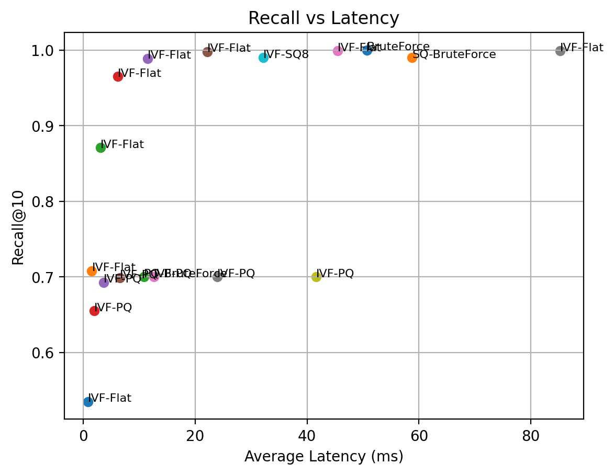
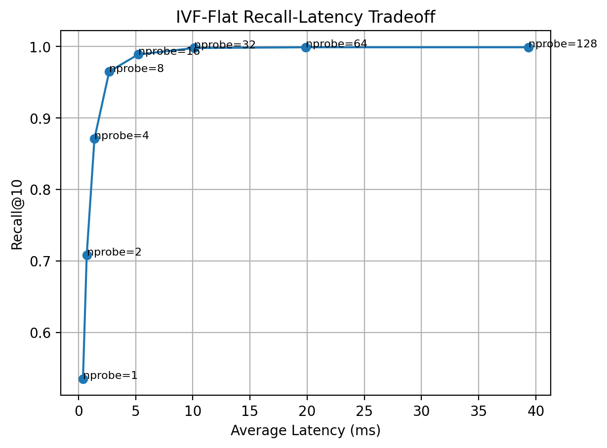
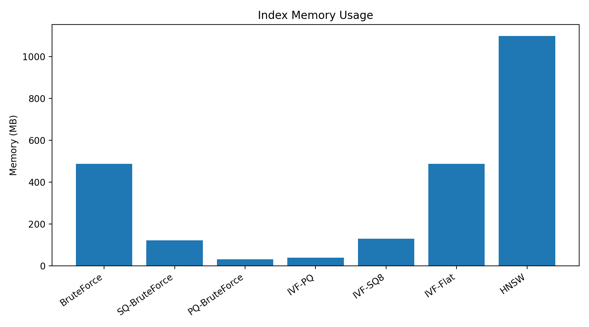
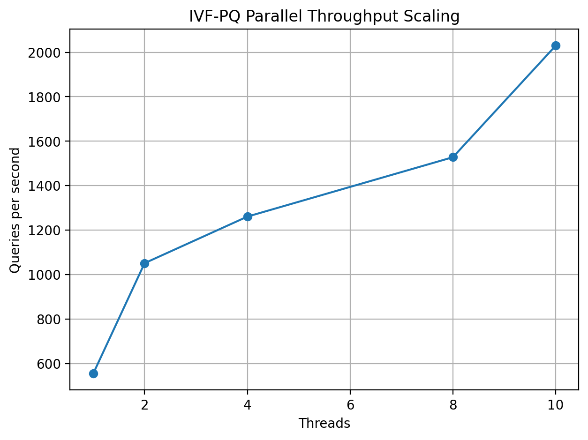

# HyperSearch

A high-performance approximate nearest neighbor (ANN) vector search engine written from scratch in modern C++.

This project implements exact and approximate vector search methods used in retrieval systems, recommendation systems, semantic search, and vector databases. The goal is to study and build the core infrastructure behind FAISS-style vector search engines, with emphasis on algorithmic depth, memory efficiency, multithreading, and benchmarking discipline.

## Highlights

- Built a vector search engine from scratch in modern C++
- Implemented IVF, SQ8, PQ, IVF-SQ, and IVF-PQ
- Benchmarked on the full **SIFT1M** dataset (1 million vectors)
- Achieved **63x latency speedup** at low-recall IVF settings
- Achieved **0.989 Recall@10 at 4.4x speedup**
- Achieved **12.7x memory reduction** with IVF-PQ
- Reached **1081 queries/sec** with multithreaded IVF-PQ

## Current Features

- Exact brute-force k-nearest-neighbor search
- Squared L2 distance kernel
- Heap-based top-k selection
- Abstract `Index` interface
- IVF-Flat index with k-means clustering
- Scalar Quantization (SQ8)
- IVF-SQ8 index
- Product Quantization (PQ)
- IVF-PQ index with asymmetric distance computation (ADC)
- Recall@k evaluation
- P50 / P95 latency benchmarking
- Memory usage reporting
- Multithreaded batch throughput benchmark
- CSV benchmark export
- SIFT1M `.fvecs` / `.ivecs` dataset loader

## Benchmark Setup

Final benchmark configuration:

- Dataset: SIFT1M
- Base vectors: 1,000,000
- Query vectors: 100
- Dimension: 128
- Metric: Squared L2 distance
- k: 10
- Build type: Release
- Compiler: GCC 14.2.0 (MSYS2 UCRT64)
- Platform: Windows
- CPU: 10-core laptop CPU

## Benchmark Results

### Brute Force Baseline

| Index | Recall@10 | Avg Latency | P50 | P95 | Memory |
|---|---:|---:|---:|---:|---:|
| BruteForce | 1.000 | 50.73 ms | 49.93 ms | 58.51 ms | 512 MB |

### Quantized Indexes

| Index | Recall@10 | Avg Latency | P50 | P95 | Memory | Memory Reduction |
|---|---:|---:|---:|---:|---:|---:|
| SQ-BruteForce | 0.990 | 58.76 ms | 58.22 ms | 60.91 ms | 128 MB | 4.0x |
| PQ-BruteForce | 0.700 | 10.83 ms | 10.72 ms | 11.62 ms | 32.1 MB | 15.9x |
| IVF-SQ8 | 0.990 | 32.16 ms | 32.28 ms | 36.82 ms | 136.1 MB | 3.76x |
| IVF-PQ (nprobe=8) | 0.693 | 3.62 ms | 3.39 ms | 6.41 ms | 40.3 MB | 12.7x |

### IVF-Flat Sweep

| nlist | nprobe | Recall@10 | Avg Latency | Speedup vs Brute |
|---:|---:|---:|---:|---:|
| 256 | 1 | 0.535 | 0.80 ms | 63.0x |
| 256 | 2 | 0.708 | 1.50 ms | 33.9x |
| 256 | 4 | 0.871 | 3.06 ms | 16.6x |
| 256 | 8 | 0.965 | 6.16 ms | 8.24x |
| 256 | 16 | 0.989 | 11.51 ms | 4.41x |
| 256 | 32 | 0.998 | 22.12 ms | 2.29x |
| 256 | 64 | 0.999 | 45.43 ms | 1.12x |
| 256 | 128 | 0.999 | 85.22 ms | 0.60x |

### Multithreaded IVF-PQ Throughput (nprobe=8)

| Threads | QPS |
|---:|---:|
| 1 | 314.58 |
| 2 | 606.83 |
| 4 | 988.75 |
| 8 | 948.70 |
| 10 | 1081.69 |


## Benchmark Plots

### Recall-Latency Scatter Plot



This plot shows the ANN tradeoff between Recall@k (here k=10) and latency.

### IVF-Flat Recall-Latency Tradeoff



This plot shows the core ANN tradeoff: increasing `nprobe` improves Recall@10 but increases query latency.

### Memory Usage



Quantized indexes significantly reduce memory usage. PQ-based indexes provide the largest compression.

### Parallel Throughput Scaling



IVF-PQ parallel batch search scales with thread count on the full SIFT1M benchmark.

## Key Results

On the full SIFT1M benchmark:

- IVF-Flat demonstrated the classic ANN recall-latency tradeoff, reaching **0.965 Recall@10 at 6.16 ms/query (8.2x speedup over brute-force)** and **0.989 Recall@10 at 11.5 ms/query (4.4x speedup over brute-force)**.
- IVF-PQ achieved **12.7x memory reduction** with **3.62 ms average latency** and **0.693 Recall@10** , providing a strong memory-latency tradeoff for compressed ANN search.
- PQ-BruteForce achieved **15.9x memory reduction** while remaining **4.7x faster than brute force**.
- IVF-PQ multithreaded batch search reached **1081 QPS** on 10 CPU cores.

## Architecture

The project is organized into reusable modules:

```text
apps/
include/ann/
src/
scripts/
results/
```

## Core Components

- `Index`: common abstract interface for all indexes
- `BruteForceIndex`: exact search baseline
- `IVFIndex`: inverted file index
- `ScalarQuantizer`: per-dimension SQ8 compression
- `SQBruteForceIndex`: brute-force search over SQ8 compressed vectors
- `IVFSQIndex`: IVF search over SQ8 compressed vectors
- `ProductQuantizer`: PQ training, encoding, decoding, and ADC distance
- `PQBruteForceIndex`: brute-force search over PQ codes
- `IVFPQIndex`: IVF search over PQ codes
- `benchmark`: latency benchmark utilities
- `parallel_benchmark`: multithreaded throughput benchmark
- `evaluation`: Recall@k evaluation
- `dataset`: `.fvecs` and `.ivecs` dataset loading
- `benchmark_report`: CSV benchmark output

## Build

This project uses CMake and Ninja.

```bash
cmake -B build-release -G Ninja -DCMAKE_BUILD_TYPE=Release
cmake --build build-release
.\build-release\ann_demo.exe
.\build-release\ann_benchmark.exe
```

## Dataset

The project supports SIFT1M `.fvecs` and `.ivecs` files.

Expected layout:

```text
data/sift1m/sift_base.fvecs
data/sift1m/sift_query.fvecs
data/sift1m/sift_groundtruth.ivecs
data/sift1m/sift_learn.fvecs
```

## Current Limitations

- Ground truth is computed using brute-force search during evaluation
- IVF/PQ training is single-threaded
- No SIMD-optimized distance kernels yet
- No persistence / index serialization
- No Python bindings
- No graph-based ANN index (e.g. HNSW)

## Roadmap

Planned next steps:

- SIMD-optimized distance kernels (AVX2/AVX-512)
- Index serialization / persistence
- Python bindings via pybind11
- HNSW graph-based ANN index
- Multi-threaded index training
- Additional benchmark datasets

## Project Goal

The goal of this project is to demonstrate systems-level AI infrastructure ability: implementing retrieval algorithms from scratch, optimizing memory layout, measuring recall-latency tradeoffs, and building a benchmarkable C++ vector search engine.
